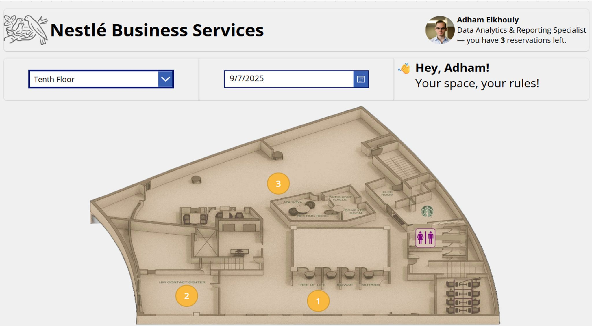
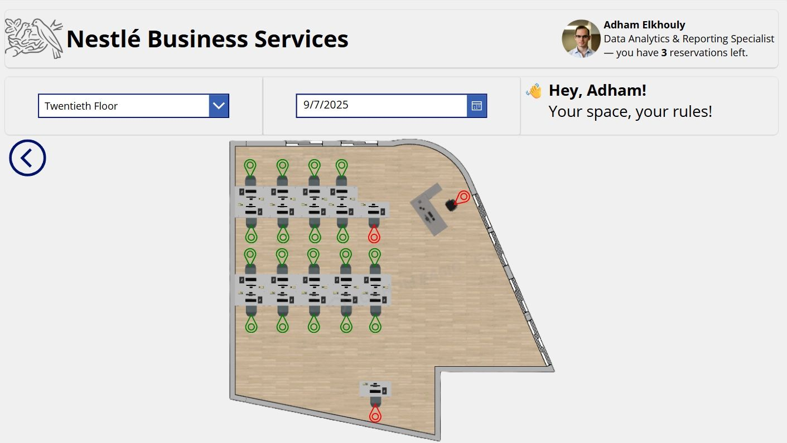
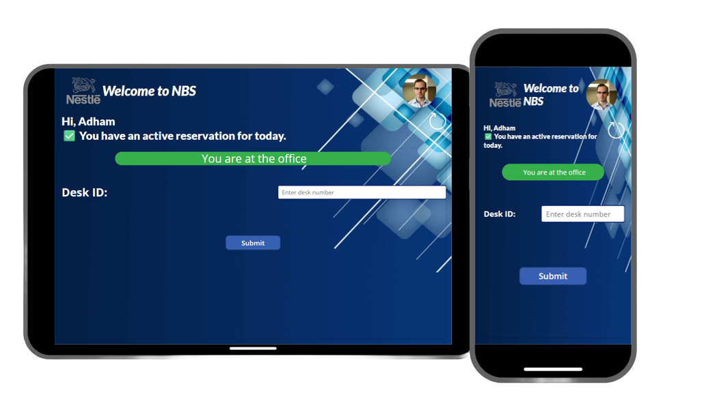
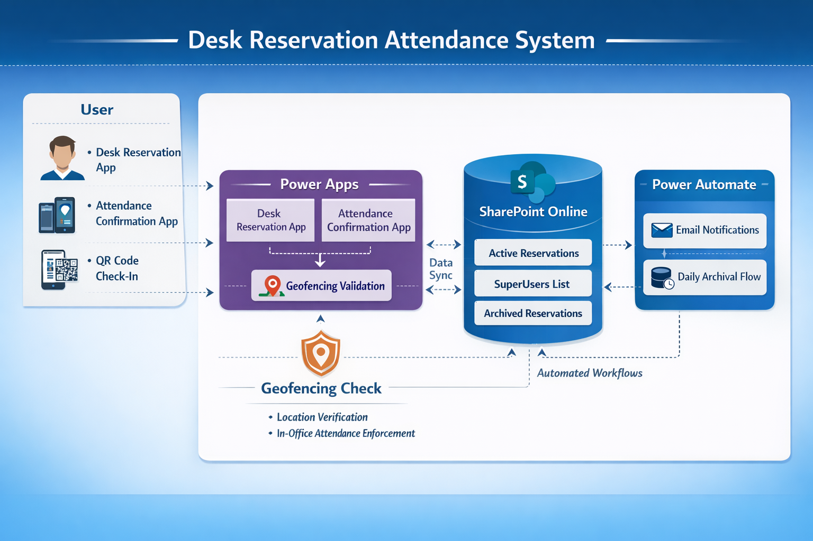

# 🏢 Desk Reservation & Attendance System

A scalable, rule-driven workspace management system built using **Microsoft Power Apps, SharePoint, and Power Automate**, designed to solve real-world office overcrowding while enforcing **fair usage, attendance accountability, and system integrity**.

---

## 🚨 The Problem

As teams scaled and hiring increased, office space became constrained:

- Desks were overbooked  
- Employees reserved desks but didn’t show up  
- No visibility into actual usage  
- No enforcement of fairness  

👉 Result: **Overcrowding, frustration, and inefficient workspace utilization**

---

## 💡 The Solution

I designed and built a **complete end-to-end system** that:

- Digitizes desk reservations across multiple floors  
- Enforces strict booking and fairness rules  
- Prevents no-shows through attendance validation  
- Ensures physical presence using geofencing  
- Maintains performance at scale through automated data lifecycle management  

---

## ⚙️ System Overview

The system manages the full lifecycle of desk reservations:

1. Users browse floors and desks  
2. Users reserve desks based on availability and rules  
3. System enforces limits and role-based permissions  
4. Users confirm attendance via QR + geofencing  
5. No-shows are automatically marked as **Expired**  
6. Past reservations are archived daily  

---

## 📱 Reservation Experience

  
  

<em>Interactive floor navigation and desk-level reservation interface with real-time availability</em>

---

## 📱 Attendance Confirmation App

  

<em>Lightweight mobile app for confirming attendance using desk ID and geofencing validation</em>

---

## 🧠 Key Capabilities

🗺️ <strong>Interactive Floor-Based Reservation</strong> 
120+ desks across 3 floors, fully digitized with visual availability indicators.

  

📅 <strong>Smart Reservation Rules</strong> 
Active limits, daily limits, and same-day booking constraints enforce fairness.

  

👥 <strong>Role-Based Access Logic</strong> 
SuperUsers can bypass limits and reserve on behalf of guests.

  

⏱️ <strong>Attendance Enforcement</strong> 
Strict confirmation deadlines (11:00 AM or 1-hour window for same-day bookings).

  

📍 <strong>Geofencing Validation</strong> 
Ensures users are physically present using GPS + Haversine distance calculation.

  

⚡ <strong>Scalable Data Architecture</strong> 
Daily archival prevents SharePoint delegation issues and keeps performance stable.

---

## 🏗️ System Architecture

  

The system consists of:

- **Application Layer** → Power Apps (Reservation + Attendance apps)  
- **Data Layer** → SharePoint lists  
- **Automation Layer** → Power Automate workflows  
- **Validation Layer** → Geofencing logic  

---

## 🧩 Tech Stack

| Layer | Technology |
|------|------------|
| Frontend | Power Apps |
| Backend | SharePoint Lists |
| Automation | Power Automate |
| Logic | Power Fx |
| Validation | Geofencing (Haversine Formula) |

---

## 🔐 Security & Confidentiality

This project was built in a real organizational environment.

To ensure security:

- No SharePoint screenshots are included  
- No internal URLs or configurations are exposed  
- Floor layouts are embedded only within `.msapp` files  
- No employee or sensitive organizational data is shared  

👉 See: `docs/security-and-confidentiality.md`

---

## ⚙️ How It Works (Simplified)

- Reservation created → **Active**  
- Attendance confirmed → **Confirmed**  
- User cancels → **Cancelled**  
- No confirmation → **Expired**  
- Daily automation archives all past records  

---

## 📊 Data Lifecycle

- Active reservations → real-time SharePoint list  
- Historical reservations → archived daily  
- Ensures:
  - high performance  
  - scalability  
  - clean operational dataset  

👉 See: `docs/data-lifecycle-and-archival.md`

---

## 🚀 Why This Project Stands Out

This is not just a Power App.

It demonstrates:

- 🧠 System design thinking  
- ⚙️ Real-world business rule enforcement  
- 📉 Performance optimization under platform constraints  
- 🔐 Security and data governance awareness  
- 📍 Physical validation using geofencing  
- 📊 Scalable data lifecycle management  

---

## ⚠️ Limitations

- Not fully mobile responsive (optimized for desktop/tablet)  
- Manual floor mapping  
- GPS-based geofencing limitations  
- Single-location deployment  

👉 See: `docs/limitations-and-future-improvements.md`

---

## 🔮 Future Improvements

- Mobile-first UI redesign  
- Dynamic desk configuration  
- Power BI analytics dashboards  
- Multi-location support  
- Advanced geofencing (WiFi / Bluetooth)  

---

## 🧑‍💻 Author

**Adham Elkhouly**

- Applied Scientist @ Microsoft  
- Passionate about building systems that solve real-world problems  
- Focused on scalable systems, automation, and data-driven design  

---

## 📄 License

This project is licensed under the MIT License.

See the `LICENSE` file for details.

---

## ⭐ Final Note

This project was built to solve a **real operational problem**.

It reflects how I approach engineering:

> Not just building features — but designing systems that enforce behavior, scale efficiently, and deliver real impact.
